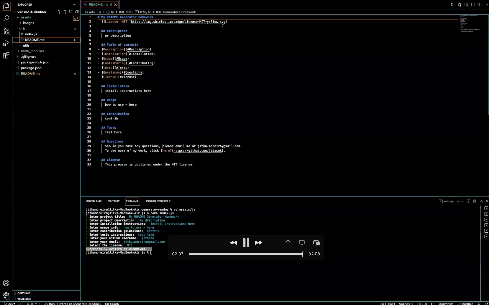

# Professional README Generator

 

## Description

A command-line application which accepts user's input and based on it dynamically generates a professional README file for a new project using the inquirer package. The newly generated README will be found in the assets/js folder.
 
 

## Motivation

The purpose of this app is to practice working with node.js, npm, inquirer, fs, and more.
 
 
Link to the deployed app: [here](https://jitasek.github.io/generate-readme/)
 
Link to the video guide: [here](https://drive.google.com/file/d/1E0dAvRmjQUrE5KG02HClb8i7FoRieMIm/view)

(If the video quaility on the link above is not sufficient for you, please download the video guide file from the repo and play it locally.)
 
 

## User Story

As a developer I want a README generator so that I can quickly create a professional README for a new project.
 
 

## Installation and Usage

Clone this repository to your local environment using the following command in your terminal:

`git clone git@github.com:jitasek/generate-readme.git`

Install all the dependencies defined in package.json to your local folder using the following command:

`npm install`

Position yourself in the js folder (cd assets/js) where the main index.js file is located and run in the command line:

`node index.js`

You will get prompted 9 times for input. After you have selected your option(s) in the last prompt, press enter and a new README file will get generated with your answers in it. You will then find it in the js folder.
 
 

## Acceptance Criteria

WHEN I am prompted for information about my application repository, a high-quality, professional README file is generated with the title of my project and sections entitled Description, Table of Contents, Installation, Usage, License, Contributing, Tests, and Questions.
 
WHEN I enter my project title, this is displayed as the title of the README.
 
WHEN I enter a description, installation instructions, usage information, contribution guidelines, and test instructions, this information is added to the sections of the README entitled Description, Installation, Usage, Contributing, and Tests.
 
WHEN I choose a license for my application from a list of options, a badge for that license is added near the top of the README and a notice is added to the section of the README entitled License that explains which license the application is covered under.
 
WHEN I enter my GitHub username, this is added to the section of the README entitled Questions, with a link to my GitHub profile.
 
WHEN I enter my email address, this is added to the section of the README entitled Questions, with instructions on how to reach me with additional questions.
 
WHEN I click on the links in the Table of Contents, I am taken to the corresponding section of the README.

## Screenshot

 

